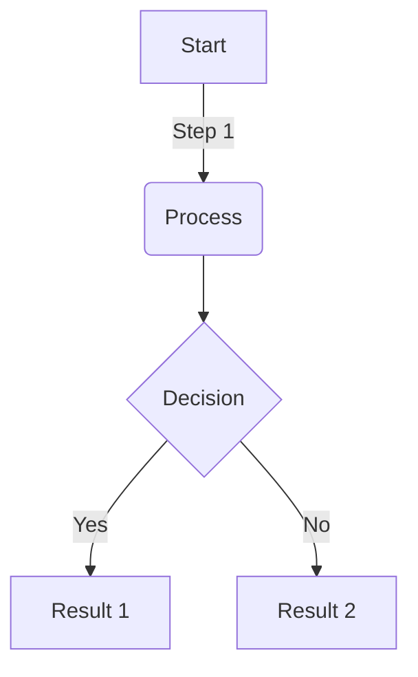
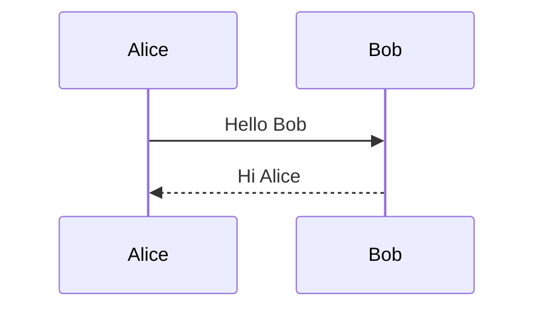

# Mermaid Test

## Flowchart


```mermaid
graph TD;
    A[Start] -->|Step 1| B(Process);
    B --> C{Decision};
    C -->|Yes| D[Result 1];
    C -->|No| E[Result 2];
```

## Sequence Diagram


```mermaid
sequenceDiagram
    Alice->>Bob: Hello Bob
    Bob-->>Alice: Hi Alice
```

## Regular code block (should still highlight)

```javascript
const x = 42;
console.log(x);
```
